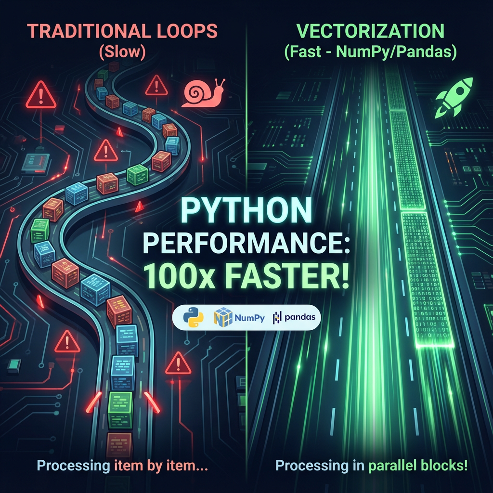

# 🚀 The Power of Vectorization: 100x Faster Image Processing in Python!

This project clearly demonstrates why using **NumPy Vectorization** over traditional `for` loops is a critical principle in scientific computing and data science. We'll take a simple task—**converting a color image to grayscale**—and show how the right approach can lead to massive performance gains.

---
# 🚀 قدرت Vectorization: پردازش تصویر ۱۰۰ برابر سریع‌تر در پایتون!

این پروژه به شکلی واضح و عملی نشان می‌دهد که چرا استفاده از **Vectorization در NumPy** به جای حلقه‌های `for` سنتی، یک اصل حیاتی در برنامه‌نویسی علمی و دیتا ساینس است. ما یک وظیفه ساده یعنی **تبدیل یک تصویر رنگی به مقیاس خاکستری** را انجام می‌دهیم و نشان می‌دهیم که رویکرد صحیح چگونه می‌تواند منجر به افزایش عملکردی عظیم شود.

<hr><hr>



<hr><hr>

## 🤔 The Problem: Pixel-by-Pixel Processing

The intuitive approach to process an image is to loop through each pixel using nested `for` loops. While logically correct, this method is **extremely slow** in Python because of its interpreted nature, the overhead of loop iterations, and its inability to leverage modern CPU hardware capabilities.

---
## 🤔 مشکل کجاست؟ پردازش پیکسل به پیکسل

رویکرد سنتی و شهودی برای پردازش یک تصویر، پیمایش تک‌تک پیکسل‌های آن با استفاده از حلقه‌های `for` تودرتو است. گرچه این روش از نظر منطقی درست است، اما در پایتون به دلیل ذات مفسری، سربار تکرار حلقه‌ها و عدم توانایی در بهره‌گیری از قابلیت‌های سخت‌افزاری CPUهای مدرن، **فوق‌العاده کند** عمل می‌کند.

<hr><hr>

## ✨ The Magic Solution: NumPy Vectorization

Vectorization means performing operations on entire arrays at once. When you write `array * 0.5`, NumPy delegates the looping to its highly optimized, pre-compiled C/Fortran code. This code executes operations in parallel (SIMD) and is thousands of times faster than a native Python loop.

---
## ✨ راه‌حل جادویی: NumPy Vectorization

Vectorization یعنی اجرای عملیات روی کل آرایه‌ها به صورت یکجا. وقتی شما کدی مانند `array * 0.5` را می‌نویسید، NumPy حلقه را به کدهای سطح پایین و کامپایل‌شده خود (C یا Fortran) منتقل می‌کند. این کدها عملیات را به صورت موازی اجرا کرده و هزاران بار سریع‌تر از یک حلقه پایتون عمل می‌کنند.

<hr><hr>

## ⚙️ Project Structure | ساختار پروژه

```
.
├── images/
│   └── sample.jpg      <-- (Place your sample image here | تصویر نمونه خود را اینجا قرار دهید)
├── .gitignore
├── image_converter.py  <-- (The main script | اسکریپت اصلی)
├── README.md           <-- (This file | همین فایل)
└── requirements.txt    <-- (Required libraries | کتابخانه‌های مورد نیاز)
```

<hr><hr>

## 🚀 How to Run | نحوه اجرا

**1. Clone the repository:**
```bash
git clone https://github.com/SeyyedSajjadFazeli/Python-Vectorization-Showcase.git
cd Python-Vectorization-Showcase
```

**2. Install prerequisites (preferably in a virtual environment):**
```bash
# Create and activate a virtual environment
python -m venv venv
# On Windows: venv\Scripts\activate | On macOS/Linux: source venv/bin/activate

# Install libraries
pip install -r requirements.txt
```

**3. Place an image** in the `images` folder (e.g., `sample.jpg`).

**4. Run the script:**
```bash
python image_converter.py
```

<hr><hr>

## 📊 Expected Results | نتایج مورد انتظار

The script will process your image using both methods and print the time taken for each. The output will be similar to this:

اسکریپت تصویر شما را با هر دو روش پردازش کرده و زمان اجرای هر کدام را نمایش می‌دهد. خروجی چیزی شبیه به این خواهد بود:

```
Processing a (1080, 1920, 3) image...

[Slow Method] Using For-Loops:
Time taken: 3.8541 seconds.

[Fast Method] Using Vectorization:
Time taken: 0.0195 seconds.

✨ Vectorization was ~197.6 times faster!
```
Two output images (`grayscale_loop.jpg` and `grayscale_vectorized.jpg`) will be saved in the root folder. They should be identical.
دو تصویر خروجی (`grayscale_loop.jpg` و `grayscale_vectorized.jpg`) که باید کاملاً یکسان باشند، در پوشه اصلی ذخیره خواهند شد.

<hr><hr>

## 🧠 Key Takeaway | نتیجه‌گیری کلیدی

> **Think in arrays, not in loops!**

Before writing a `for` loop to process numerical data, always ask: "Is there a NumPy/Pandas way to do this all at once?" The answer is almost always "yes," and this small change in thinking will have a massive impact on your code's performance.

---
> **همیشه به جای حلقه‌ها، با آرایه‌ها فکر کنید!**

قبل از نوشتن هر حلقه `for` برای پردازش داده‌های عددی، از خود بپرسید: «آیا راهی برای انجام این کار به صورت یکجا در NumPy/Pandas وجود دارد؟» پاسخ تقریباً همیشه «بله» است و این تغییر کوچک در نگرش، تأثیری شگرف بر عملکرد کد شما خواهد گذاشت.

---
*Created by SeyyedSajjadFazeli*
